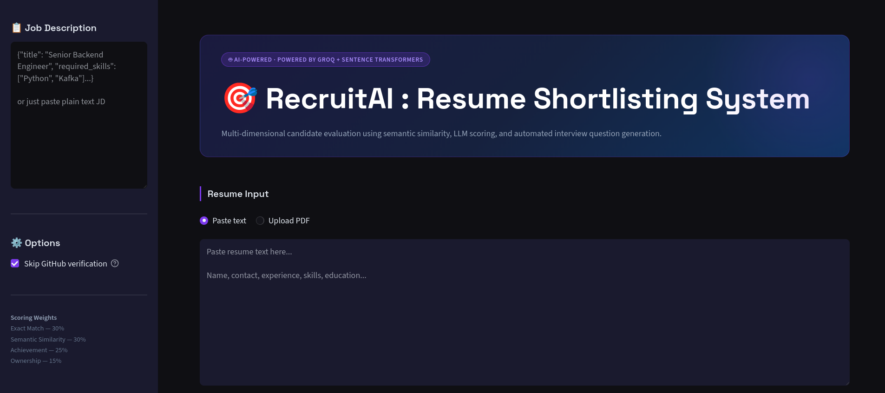
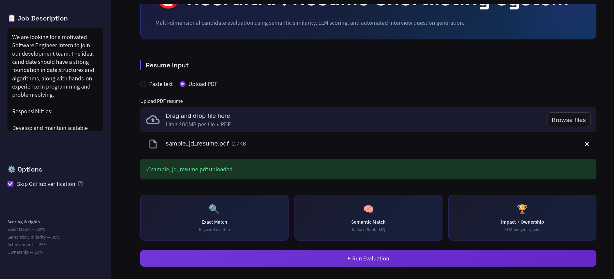
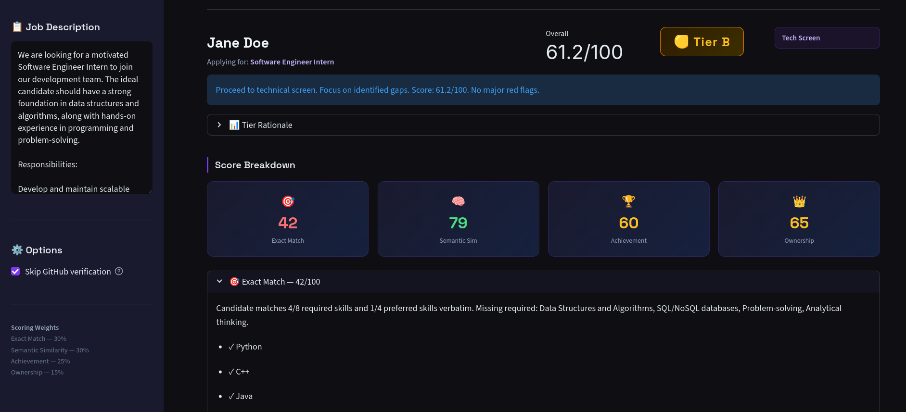
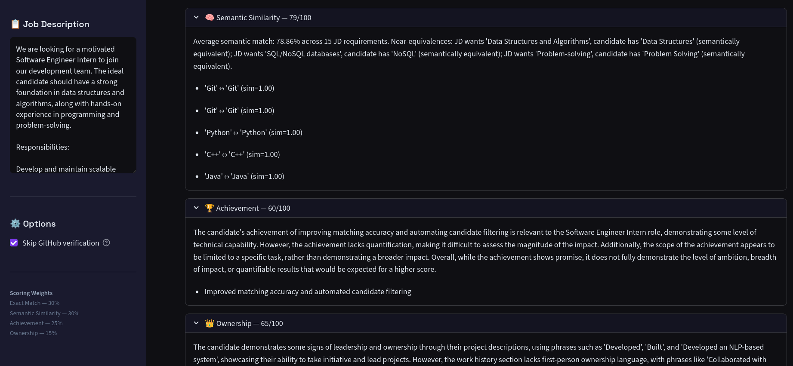
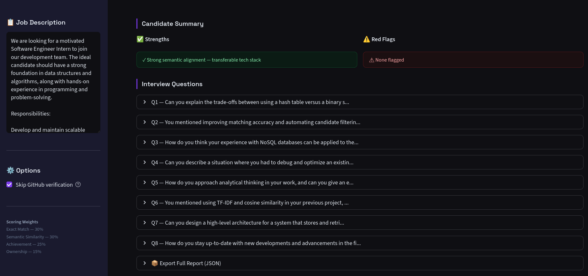

# RecruitAI : AI Resume Shortlisting & Interview Assistant

An end-to-end system that automates candidate evaluation by parsing resumes, scoring them against Job Descriptions across 4 dimensions, verifying GitHub claims, and generating tailored interview question sets.

> **Stack:** Python · Groq (Llama 3.3 70B) · Sentence Transformers · Streamlit · Pydantic
> **Track:** AI / Backend

---

## Demo

Main UI

Add a JD text, and upload the resume. Click on "Run Evaluation":

Results (descriptive):




---

## Quick Start

```bash
git clone https://github.com/tanvi876/resume-shortlisting-system.git
cd resume-shortlisting-system

python3 -m venv venv && source venv/bin/activate
pip install -r requirements.txt

cp .env.example .env
# Add your GROQ_API_KEY to .env

streamlit run app.py
```

---

## Architecture

```
                    ┌──────────────────────────────────────────┐
                    │               pipeline.py                │
                    │         (Single Orchestration Layer)     │
                    └──┬──────────┬──────────┬────────────────┘
                       │          │          │
             ┌─────────▼──┐  ┌───▼────┐  ┌──▼──────────────┐
             │  Resume    │  │Scoring │  │  Verification   │
             │  Parser    │  │Engine  │  │  Engine         │
             └─────────┬──┘  └───┬────┘  └──┬──────────────┘
                       │         │           │
                    ┌──▼─────────▼───────────▼──┐
                    │      Question Generator    │
                    │   (Tier → Questions)       │
                    └────────────────────────────┘
```

| Module | Responsibility |
|--------|---------------|
| `resume_parser.py` | PDF/text -> LLM call -> structured `ParsedResume` |
| `scoring_engine.py` | 4-dimensional scoring with embeddings + LLM |
| `verification_engine.py` | GitHub REST API claim verification |
| `question_generator.py` | Tier classification + tailored question generation |
| `pipeline.py` | Orchestrates all modules end-to-end |
| `app.py` | Streamlit UI |

---

## Scoring Model

| Dimension | Weight | Method |
|-----------|--------|--------|
| **Exact Match** | 30% | Case-insensitive keyword intersection against JD requirements |
| **Semantic Similarity** | 30% | `all-MiniLM-L6-v2` cosine similarity matrix |
| **Achievement** | 25% | LLM evaluation of quantified impact claims |
| **Ownership** | 15% | LLM analysis of leadership and initiative language |

### How Semantic Similarity catches Kafka vs RabbitMQ

Both terms sit close together in the embedding space since they're both message queue technologies. The scoring matrix computes cosine similarity between every JD term and every resume term, so a candidate with RabbitMQ experience will score around 0.72 similarity against a Kafka requirement. This gets surfaced in the score explanation as evidence like `'Kafka' <-> 'RabbitMQ' (sim=0.72)`.

### Tier Classification

| Tier | Score | Action |
|------|-------|--------|
| 🟢 A | >= 72 | Fast-track to final round |
| 🟡 B | 48-71 | Technical screen |
| 🔴 C | < 48 | Calibration call first |

---

## GitHub Verification

For each candidate-provided GitHub URL, the system checks:
- Account age (flags accounts under 90 days old)
- Original repos vs forks
- Recent push activity
- Language distribution vs claimed skills
- Community stars received

LinkedIn URLs are validated for format only since LinkedIn blocks scraping.

---

## Scalability Notes

For 10,000+ resumes/day the main changes would be:

1. **Async processing** - swap synchronous LLM calls for async batching; Groq handles high-throughput well
2. **Queue-based ingestion** - push resumes to SQS/Kafka and have a worker pool evaluate them
3. **Embedding caching** - JD embeddings only need to be computed once per JD and can be cached in Redis
4. **GitHub rate limiting** - 60 req/hr unauthenticated is a bottleneck; token pool + exponential backoff solves this
5. **Storage** - write reports to PostgreSQL and use pgvector for similarity search across evaluated candidates
6. **Horizontal scaling** - every `pipeline.evaluate()` call is stateless so you can just run more container replicas

---

## Tests

```bash
# Unit tests, no API key needed
python -m pytest tests/ -v -m "not integration"

# Full integration test, needs GROQ_API_KEY
python -m pytest tests/ -v
```

---

## Environment Variables

| Variable | Required | Description |
|----------|----------|-------------|
| `GROQ_API_KEY` | Yes | Groq API key (free at console.groq.com) |
| `GITHUB_TOKEN` | No | Raises GitHub rate limit from 60 to 5000 req/hr |

---

## AI Usage

**What I used AI for:**
- Brainstorming the four scoring dimensions and weights
- First drafts of the achievement and ownership scorer prompts
- Debugging a JSON parsing issue where the model kept wrapping output in markdown fences

**What I changed manually:**
- All prompts were iterated by hand. The ownership scorer was initially too generic; adding an explicit instruction to cite specific language from the resume made a big difference to explainability
- Chose `sentence-transformers` over LLM-based similarity scoring myself. It's deterministic, fast, and doesn't add API costs per comparison
- Tier thresholds (72/48) were set by testing against a few sample resumes, not pulled from anywhere

**Where I disagreed with AI:**
The AI suggested LangChain's structured output parser for JSON extraction. I skipped it because LangChain is heavy for what's essentially a `json.loads` call with a two-line regex fence-stripper. Keeping it manual also makes it easier to debug when the model misbehaves.